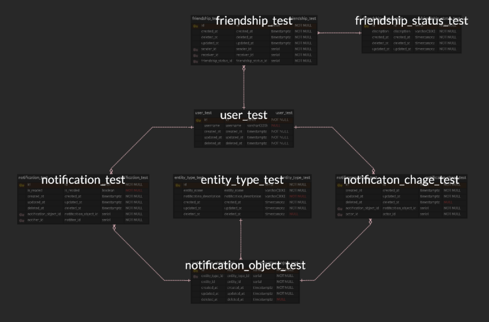

# Simple-notification-service

본 저장소는 notification-service를 간단하게 개발한 내용을 담고 있습니다.

## Stack

| STACK                |   Server             |
|:--------------------:|:--------------------:|
| Developer            |   fullgukbap         |
| Develop Language     |   GO (gofiber/v2)    |
| DB                   |   mysql              |
| Develop Tool         |   Visual Studio Code |
| ORM                  |   ent                |

## ERD



## Migrated Schemas

```go
EntityType:
        +-------------------------+-----------+--------+----------+----------+---------+---------------+-----------+------------------------------------------+------------+---------+
        |          Field          |   Type    | Unique | Optional | Nillable | Default | UpdateDefault | Immutable |                StructTag                 | Validators | Comment |
        +-------------------------+-----------+--------+----------+----------+---------+---------------+-----------+------------------------------------------+------------+---------+
        | id                      | int       | false  | false    | false    | false   | false         | false     | json:"id,omitempty"                      |          0 |         |
        | created_at              | time.Time | false  | false    | false    | true    | false         | true      | json:"created_at,omitempty"              |          0 |         |
        | updated_at              | time.Time | false  | false    | false    | true    | true          | false     | json:"updated_at,omitempty"              |          0 |         |
        | deleted_at              | time.Time | false  | true     | false    | false   | false         | false     | json:"deleted_at,omitempty"              |          0 |         |
        | entityName              | string    | false  | false    | false    | false   | false         | false     | json:"entityName,omitempty"              |          0 |         |
        | notificationDescription | string    | false  | false    | false    | false   | false         | false     | json:"notificationDescription,omitempty" |          0 |         |
        +-------------------------+-----------+--------+----------+----------+---------+---------------+-----------+------------------------------------------+------------+---------+
        +---------------------+--------------------+---------+---------+----------+--------+----------+---------+
        |        Edge         |        Type        | Inverse | BackRef | Relation | Unique | Optional | Comment |
        +---------------------+--------------------+---------+---------+----------+--------+----------+---------+
        | notificationObjects | NotificationObject | false   |         | O2M      | false  | true     |         |
        +---------------------+--------------------+---------+---------+----------+--------+----------+---------+

Friendship:
        +------------+-----------+--------+----------+----------+---------+---------------+-----------+-----------------------------+------------+---------+
        |   Field    |   Type    | Unique | Optional | Nillable | Default | UpdateDefault | Immutable |          StructTag          | Validators | Comment |
        +------------+-----------+--------+----------+----------+---------+---------------+-----------+-----------------------------+------------+---------+
        | id         | int       | false  | false    | false    | false   | false         | false     | json:"id,omitempty"         |          0 |         |
        | created_at | time.Time | false  | false    | false    | true    | false         | true      | json:"created_at,omitempty" |          0 |         |
        | updated_at | time.Time | false  | false    | false    | true    | true          | false     | json:"updated_at,omitempty" |          0 |         |
        | deleted_at | time.Time | false  | true     | false    | false   | false         | false     | json:"deleted_at,omitempty" |          0 |         |
        +------------+-----------+--------+----------+----------+---------+---------------+-----------+-----------------------------+------------+---------+
        +------------------+------------------+---------+---------------------+----------+--------+----------+---------+
        |       Edge       |       Type       | Inverse |       BackRef       | Relation | Unique | Optional | Comment |
        +------------------+------------------+---------+---------------------+----------+--------+----------+---------+
        | sender           | User             | true    | friendshipsReceiver | M2O      | true   | true     |         |
        | receiver         | User             | true    | friendshipsSender   | M2O      | true   | true     |         |
        | friendshipStatus | FriendshipStatus | true    | friendships         | M2O      | true   | true     |         |
        +------------------+------------------+---------+---------------------+----------+--------+----------+---------+

FriendshipStatus:
        +-------------+-----------+--------+----------+----------+---------+---------------+-----------+------------------------------+------------+---------+
        |    Field    |   Type    | Unique | Optional | Nillable | Default | UpdateDefault | Immutable |          StructTag           | Validators | Comment |
        +-------------+-----------+--------+----------+----------+---------+---------------+-----------+------------------------------+------------+---------+
        | id          | int       | false  | false    | false    | false   | false         | false     | json:"id,omitempty"          |          0 |         |
        | created_at  | time.Time | false  | false    | false    | true    | false         | true      | json:"created_at,omitempty"  |          0 |         |
        | updated_at  | time.Time | false  | false    | false    | true    | true          | false     | json:"updated_at,omitempty"  |          0 |         |
        | deleted_at  | time.Time | false  | true     | false    | false   | false         | false     | json:"deleted_at,omitempty"  |          0 |         |
        | description | string    | true   | false    | false    | false   | false         | false     | json:"description,omitempty" |          0 |         |
        +-------------+-----------+--------+----------+----------+---------+---------------+-----------+------------------------------+------------+---------+
        +-------------+------------+---------+---------+----------+--------+----------+---------+
        |    Edge     |    Type    | Inverse | BackRef | Relation | Unique | Optional | Comment |
        +-------------+------------+---------+---------+----------+--------+----------+---------+
        | friendships | Friendship | false   |         | O2M      | false  | true     |         |
        +-------------+------------+---------+---------+----------+--------+----------+---------+

Notification:
        +------------+-----------+--------+----------+----------+---------+---------------+-----------+-----------------------------+------------+---------+
        |   Field    |   Type    | Unique | Optional | Nillable | Default | UpdateDefault | Immutable |          StructTag          | Validators | Comment |
        +------------+-----------+--------+----------+----------+---------+---------------+-----------+-----------------------------+------------+---------+
        | id         | int       | false  | false    | false    | false   | false         | false     | json:"id,omitempty"         |          0 |         |
        | created_at | time.Time | false  | false    | false    | true    | false         | true      | json:"created_at,omitempty" |          0 |         |
        | updated_at | time.Time | false  | false    | false    | true    | true          | false     | json:"updated_at,omitempty" |          0 |         |
        | deleted_at | time.Time | false  | true     | false    | false   | false         | false     | json:"deleted_at,omitempty" |          0 |         |
        | isRead     | bool      | false  | false    | false    | true    | false         | false     | json:"isRead,omitempty"     |          0 |         |
        +------------+-----------+--------+----------+----------+---------+---------------+-----------+-----------------------------+------------+---------+
        +--------------------+--------------------+---------+---------------+----------+--------+----------+---------+
        |        Edge        |        Type        | Inverse |    BackRef    | Relation | Unique | Optional | Comment |
        +--------------------+--------------------+---------+---------------+----------+--------+----------+---------+
        | notificationObject | NotificationObject | true    | notifications | M2O      | true   | true     |         |
        | notifier           | User               | true    | notifications | M2O      | true   | true     |         |
        +--------------------+--------------------+---------+---------------+----------+--------+----------+---------+

NotificationChange:
        +------------+-----------+--------+----------+----------+---------+---------------+-----------+-----------------------------+------------+---------+
        |   Field    |   Type    | Unique | Optional | Nillable | Default | UpdateDefault | Immutable |          StructTag          | Validators | Comment |
        +------------+-----------+--------+----------+----------+---------+---------------+-----------+-----------------------------+------------+---------+
        | id         | int       | false  | false    | false    | false   | false         | false     | json:"id,omitempty"         |          0 |         |
        | created_at | time.Time | false  | false    | false    | true    | false         | true      | json:"created_at,omitempty" |          0 |         |
        | updated_at | time.Time | false  | false    | false    | true    | true          | false     | json:"updated_at,omitempty" |          0 |         |
        | deleted_at | time.Time | false  | true     | false    | false   | false         | false     | json:"deleted_at,omitempty" |          0 |         |
        +------------+-----------+--------+----------+----------+---------+---------------+-----------+-----------------------------+------------+---------+
        +--------------------+--------------------+---------+---------------------+----------+--------+----------+---------+
        |        Edge        |        Type        | Inverse |       BackRef       | Relation | Unique | Optional | Comment |
        +--------------------+--------------------+---------+---------------------+----------+--------+----------+---------+
        | actor              | User               | true    | notificationChanges | M2O      | true   | true     |         |
        | notificationObject | NotificationObject | true    | notificationChanges | M2O      | true   | true     |         |
        +--------------------+--------------------+---------+---------------------+----------+--------+----------+---------+

NotificationObject:
        +------------+-----------+--------+----------+----------+---------+---------------+-----------+-----------------------------+------------+---------+
        |   Field    |   Type    | Unique | Optional | Nillable | Default | UpdateDefault | Immutable |          StructTag          | Validators | Comment |
        +------------+-----------+--------+----------+----------+---------+---------------+-----------+-----------------------------+------------+---------+
        | id         | int       | false  | false    | false    | false   | false         | false     | json:"id,omitempty"         |          0 |         |
        | created_at | time.Time | false  | false    | false    | true    | false         | true      | json:"created_at,omitempty" |          0 |         |
        | updated_at | time.Time | false  | false    | false    | true    | true          | false     | json:"updated_at,omitempty" |          0 |         |
        | deleted_at | time.Time | false  | true     | false    | false   | false         | false     | json:"deleted_at,omitempty" |          0 |         |
        | entity_id  | int       | false  | false    | false    | false   | false         | false     | json:"entity_id,omitempty"  |          1 |         |
        +------------+-----------+--------+----------+----------+---------+---------------+-----------+-----------------------------+------------+---------+
        +---------------------+--------------------+---------+---------------------+----------+--------+----------+---------+
        |        Edge         |        Type        | Inverse |       BackRef       | Relation | Unique | Optional | Comment |
        +---------------------+--------------------+---------+---------------------+----------+--------+----------+---------+
        | notifications       | Notification       | false   |                     | O2M      | false  | true     |         |
        | notificationChanges | NotificationChange | false   |                     | O2M      | false  | true     |         |
        | entityType          | EntityType         | true    | notificationObjects | M2O      | true   | true     |         |
        +---------------------+--------------------+---------+---------------------+----------+--------+----------+---------+

User:
        +------------+-----------+--------+----------+----------+---------+---------------+-----------+-----------------------------+------------+---------+
        |   Field    |   Type    | Unique | Optional | Nillable | Default | UpdateDefault | Immutable |          StructTag          | Validators | Comment |
        +------------+-----------+--------+----------+----------+---------+---------------+-----------+-----------------------------+------------+---------+
        | id         | int       | false  | false    | false    | false   | false         | false     | json:"id,omitempty"         |          0 |         |
        | created_at | time.Time | false  | false    | false    | true    | false         | true      | json:"created_at,omitempty" |          0 |         |
        | updated_at | time.Time | false  | false    | false    | true    | true          | false     | json:"updated_at,omitempty" |          0 |         |
        | deleted_at | time.Time | false  | true     | false    | false   | false         | false     | json:"deleted_at,omitempty" |          0 |         |
        | username   | string    | true   | false    | false    | false   | false         | false     | json:"username,omitempty"   |          0 |         |
        +------------+-----------+--------+----------+----------+---------+---------------+-----------+-----------------------------+------------+---------+
        +---------------------+--------------------+---------+---------+----------+--------+----------+---------+
        |        Edge         |        Type        | Inverse | BackRef | Relation | Unique | Optional | Comment |
        +---------------------+--------------------+---------+---------+----------+--------+----------+---------+
        | friendshipsReceiver | Friendship         | false   |         | O2M      | false  | true     |         |
        | friendshipsSender   | Friendship         | false   |         | O2M      | false  | true     |         |
        | notifications       | Notification       | false   |         | O2M      | false  | true     |         |
        | notificationChanges | NotificationChange | false   |         | O2M      | false  | true     |         |
        +---------------------+--------------------+---------+---------+----------+--------+----------+---------+
```

## Reference

Design notification system for RDBMS

- <https://tannguyenit95.medium.com/designing-a-notification-system-1da83ca971bc>

Gofiber v2

- <https://docs.gofiber.io>

ent

- <https://entgo.io/docs/getting-started>
